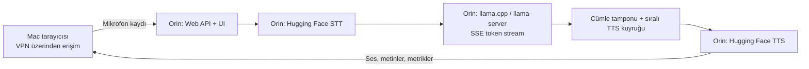

# Orin Türkçe Sesli Asistan Demo — Teknik Spec

**Durum:** Tasarım onaylandı, uygulama planı bekliyor  
**Tarih:** 2026-07-27  
**Kapsam:** Tek kullanıcılı, Türkçe, edge üzerinde çalışan konuşma döngüsü

## 1. Amaç

NVIDIA Jetson Orin üzerinde tamamen çalışan Türkçe bir sesli asistan demosu oluşturmak. Kullanıcı tarayıcıdan mikrofon kaydını başlatır ve durdurur; sistem ses kaydını metne dönüştürür (STT), metni Orin'deki `llama.cpp` sunucusuna gönderir, yanıtı sese dönüştürür (TTS) ve sesi otomatik oynatır.

Demo yalnızca işlevi değil edge performansını da göstermelidir. Her turda STT, LLM, TTS ve uçtan uca gecikme ayrı ölçülür. LLM yanıtı tamamlanmadan, tamamlanan ilk cümle TTS'e gönderilir ve kullanıcı ilk sesi duymaya başlar.

## 2. Kapsam

### Dahil

- Türkçe mikrofon → STT → LLM → TTS → otomatik oynatma döngüsü
- Orin üzerinde backend, Hugging Face STT/TTS modelleri ve `llama.cpp`
- Mevcut Orin `llama-server` kurulumuna HTTP ile bağlanma
- LLM token stream'inden cümle sınırında artımlı TTS üretimi
- Tarayıcı UI: kayıt kontrolü, durum, transcript, LLM yanıtı, ses ve metrikler
- Tek aktif istek, ayrıntılı süre/hata ölçümü ve temel smoke testleri

### Hariç

- RAG, Qdrant, embedding, doküman yükleme
- Kimlik doğrulama, kullanıcı hesabı, çoklu kullanıcı ve kalıcı sohbet hafızası
- Barge-in, eşzamanlı konuşmalar ve model fine-tuning

## 3. Sistem Sınırı ve Dağıtım

Orin edge cihazdır; tüm uygulama ve inference yükünü taşır. Mac yalnızca VPN üzerinden Orin'e erişen tarayıcı istemcisidir; Mac üzerinde STT, TTS veya LLM çalışmaz.



Orin servisleri:

1. **Web uygulaması:** Statik frontend'i ve API'yi sunar.
2. **Orchestrator backend:** Tur durumlarını, timeout'ları, model çağrılarını, geçici dosyaları ve metrikleri yönetir.
3. **STT runtime:** Seçilecek Hugging Face modeli Türkçe sesi metne çevirir.
4. **LLM runtime:** Mevcut `llama-server`, OpenAI-uyumlu API'den SSE token stream'i üretir.
5. **Cümle koordinatörü:** Tokenları sırayla biriktirir, tamamlanmış cümleleri TTS kuyruğuna verir ve tüm yanıt metnini toplar.
6. **TTS runtime:** Seçilecek Hugging Face modeli her cümle parçasını sırayla sese çevirir.

## 4. Kullanıcı Akışı

1. UI açılır; backend, STT, TTS ve llama.cpp sağlık durumu gösterilir.
2. Kullanıcı **Kaydı başlat** düğmesine basar; tarayıcı mikrofondan kaydeder.
3. Kullanıcı **Kaydı durdur** düğmesine basar; ses backend'e yüklenir.
4. UI sırasıyla `uploading`, `transcribing`, `generating`, `synthesizing` ve `playing` durumlarını gösterir.
5. Boş/geçersiz STT sonucu LLM ve TTS'e gönderilmez.
6. Backend yalnızca Türkçe sistem prompt'u ve mevcut transcript ile `stream: true` LLM çağrısı yapar; RAG bağlamı veya sohbet geçmişi eklemez.
7. Backend tokenları biriktirir; `.` , `?` veya `!` ile biten her tamamlanmış cümleyi sırasını koruyarak TTS kuyruğuna gönderir. LLM sonraki cümleleri üretirken TTS önceki cümleyi sentezler.
8. UI, LLM'in biriken metnini gösterir ve hazır olan ilk ses parçasını otomatik oynatır; tarayıcı engellerse manuel oynat düğmesi görünür.
9. Tur bittiğinde kayıt kontrolü yeniden etkinleşir.

## 5. Mimari Kararlar

### 5.1 Tek aktif tur

İlk sürümde yalnızca bir tur çalışır. Tur sürerken yeni kayıt başlatılamaz. Bu, Orin GPU/RAM yükünü öngörülebilir tutar ve gecikme ölçümlerini ayrıştırır.

### 5.2 Model yaşam döngüsü

STT/TTS modelleri backend başlangıcında yüklenir ve bellekte sıcak tutulur. `llama-server` demo öncesi başlatılır; backend çağrı öncesinde sağlığını doğrular. İlk kullanıcı isteği model indirmeyi veya yüklemeyi tetiklemez.

### 5.3 Ses ve geçici veriler

Tarayıcı kaydı multipart ses dosyası olarak gönderilir. Backend gerekirse sunucu tarafında STT uyumlu biçime dönüştürür. Ara dosyalar tur kimliği ile ayrılır; başarılı turdan sonra silinir. TTS sesi kısa ömürlü URL ile sunulur. Ham ses ve konuşma içeriği varsayılan olarak kalıcı tutulmaz; anonim metrikler kalabilir.

### 5.4 LLM sözleşmesi

Backend, `POST /v1/chat/completions` kullanan OpenAI-uyumlu `llama-server`a bağlanır. İstek, seçilen model, kısa Türkçe sistem prompt'u, tek kullanıcı mesajı, timeout ve üretim sınırı içerir. Güvenli yapılandırma özeti ve telemetri metriğe yazılır; prompt içeriği varsayılan olarak loglanmaz.

### 5.5 Artımlı cümle-TTS sözleşmesi

LLM isteği `stream: true` ile açılır. Koordinatör SSE delta'larını sırayla metin tamponuna ekler. Cümle; Türkçe cümle sonu işareti (`.` , `?` , `!`) ve ardından boşluk, stream sonu veya kapanış işareti görüldüğünde tamamlanmış kabul edilir. Kısaltma, ondalık sayı ve beklenen Türkçe istisnalar için cümle ayırıcı kuralı test edilir.

Tamamlanan cümleler monoton bir `sequence` numarasıyla TTS kuyruğuna eklenir. TTS, ses parçalarını bu sırayla üretir; istemci de aynı sırayla oynatır. LLM akışı tamamlandığında son işaretsiz metin de son cümle parçası olarak kuyruğa alınır. Çıktının tamamı TTS tamamlanmasını beklemeden LLM metin alanında gösterilir.

LLM decode ve TTS aynı Orin GPU'sunu paylaşabilir. Bu nedenle koordinatör GPU belleği yetersizliği veya tekrarlayan timeout tespit ettiğinde turu açık hata ile durdurur; sessizce parça atlamaz. Eşzamanlı decode/sentez performansı uygulama öncesi smoke testte ölçülür.

## 6. Arayüz Gereksinimleri

- **Bağlantı bandı:** Backend/STT/TTS/llama.cpp sağlık durumu.
- **Kayıt kontrolü:** Başlat/Durdur, kayıt süresi ve mikrofon izin hatası.
- **İşlem durumu:** Aktif pipeline aşaması ve Türkçe hata mesajı.
- **Konuşma görünümü:** Kullanıcı transkripti ve LLM yanıtı.
- **Ses yanıtı:** Hazır olan cümle seslerini sırayla otomatik oynatan kuyruk ve gerekirse manuel oynat.
- **Performans kartı:** Upload, STT, LLM, TTS, toplam süre, ilk cümlenin hazır olma zamanı ve ilk sesin oynatma zamanı; LLM token/sn mevcutsa ayrıca gösterilir.

Masaüstü VPN demosu hedeflenir; arayüz responsive ve okunaklı olmalıdır, mobil-first zorunlu değildir.

## 7. Backend API Sözleşmesi

### `GET /api/health`

```json
{
  "status": "ok",
  "stt_ready": true,
  "tts_ready": true,
  "llm_ready": true,
  "llm_base_url": "configured"
}
```

Gerçek LLM adresi istemciye döndürülmez.

### `POST /api/turns`

`audio` multipart alanını kabul eder. Aktif tur varsa `409 Conflict` döner.

```json
{
  "turn_id": "uuid",
  "transcript": "...",
  "answer": "...",
  "audio_url": "/api/audio/uuid.wav",
  "metrics": {
    "upload_ms": 0,
    "stt_ms": 0,
    "llm_ms": 0,
    "tts_ms": 0,
    "first_sentence_ready_ms": null,
    "first_audio_started_ms": null,
    "total_ms": 0,
    "llm_prompt_tokens": null,
    "llm_completion_tokens": null,
    "llm_tokens_per_second": null
  }
}
```

Token telemetrisi `llama-server` sağladığında sayısal olur; aksi halde `null` kalır, sıfır gibi raporlanmaz. İlk sürümde `POST /api/turns` tamamlanmış tur sonucunu döndürebilir; cümle-ses parçalarını arayüze zamanında ulaştırmak için uygulanacak taşıma biçimi (SSE, WebSocket veya ardışık HTTP) Open Questions'ta karara bağlanır.

### `GET /api/audio/{turn_id}`

TTS sesini uygun `Content-Type` ile döndürür. Dosya yoksa veya süresi dolmuşsa `404` döner.

### `GET /api/metrics/recent`

Son tamamlanan turların anonim metrik özetini döndürür. İlk sürümde yalnızca geçerli süreç/oturum için tutulması yeterlidir.

## 8. Hata Davranışı

| Durum | Sistem davranışı | Kullanıcı mesajı |
|---|---|---|
| Mikrofon izni reddedildi | Backend çağrısı yapılmaz | Mikrofon izni gerekli. |
| Boş/kısa kayıt | STT öncesi reddedilir | Kayıt algılanamadı, tekrar deneyin. |
| STT başarısız veya boş | LLM/TTS atlanır | Konuşma anlaşılamadı, tekrar deneyin. |
| llama.cpp erişilemiyor | Tur başarısız, hata kodu kaydedilir | Dil modeli şu anda erişilemiyor. |
| LLM timeout/boş yanıt | Henüz TTS'e gönderilmemiş metin atlanır; önceki ses parçaları korunur | Yanıt üretilemedi, tekrar deneyin. |
| Cümle ayırma belirsizliği | Parça güvenli sınır oluşana kadar tamponda tutulur | Yanıt hazırlanıyor. |
| TTS başarısız | Metin korunur, ses yoktur | Metin yanıtı hazır, ses üretilemedi. |
| Autoplay engeli | Ses hazır kalır | Oynat düğmesine basın. |
| Aktif tur varken istek | İkinci istek reddedilir | Mevcut yanıt tamamlanıyor. |

Her hata API'de makine-okunur `code` ve Türkçe `message` ile döner. Ham exception, model yolu, erişim anahtarı ve VPN bilgisi istemciye gönderilmez.

## 9. Yapılandırma

Ortam bağımlı değerler git-dışı `.env` veya çevre değişkenlerinden gelir:

- `LLAMA_CPP_BASE_URL`, `LLAMA_CPP_MODEL`
- `STT_MODEL_ID`, `TTS_MODEL_ID`
- `STT_DEVICE`, `TTS_DEVICE` ve ilgili dtype/quantization ayarları
- `AUDIO_MAX_SECONDS`, `AUDIO_MAX_BYTES`, `AUDIO_RETENTION_SECONDS`
- `LLM_TIMEOUT_SECONDS`, `STT_TIMEOUT_SECONDS`, `TTS_TIMEOUT_SECONDS`
- `CORS_ORIGINS`

Model kimlikleri ile model-spesifik ön/son işleme, bilinçli olarak bu spec'te açık seçimdir; uygulama içinde sabitlenmez.

## 10. Performans ve Gözlemlenebilirlik

Her tur için timestamp, sonuç durumu, kayıt süresi/boyutu/biçimi, upload-STT-LLM-TTS-toplam süreleri, ilk cümlenin hazır olma süresi, ilk sesin oynatma süresi, cümle/ses parçası sayısı, transcript/yanıt uzunlukları, LLM token telemetrisi, hata aşaması/kodu/timeout ve güvenli model-yapılandırma özeti kaydedilir.

Model seçimi yapılmadan mutlak gecikme hedefi koyulmaz. Validasyon; aşamaları ayrı gösterebilmeli, başarısız turları ayırt etmeli ve aynı ayarlarla tekrar üretilebilir sonuç vermelidir.

## 11. Operasyonel Sınırlar

- API yalnızca VPN/yerel ağ demosu olarak ele alınır; public internete açılmaz.
- CORS demo UI origin'i ile sınırlıdır.
- SSH/VPN bilgileri, token'lar ve anahtarlar loglanmaz veya commit edilmez.
- Demo öncesi Orin disk alanı, GPU/RAM, CUDA ve `llama-server` sağlığı kontrol edilir.
- İstemcide STT/TTS/LLM yüklenmez; tüm inference yalnızca Orin'dedir.

## 12. Kabul Kriterleri

1. VPN üzerinden tarayıcı mikrofon kaydını başlatıp durdurabilir.
2. Türkçe ses için STT → llama.cpp → TTS zinciri başarılı çalışır.
3. Başarılı turda transcript, metin yanıtı ve otomatik oynatılan ses görünür.
4. STT, LLM, TTS ve toplam gecikme ayrı gösterilir.
5. LLM yanıtı bitmeden tamamlanmış ilk cümle TTS'e gönderilir ve ilk ses parçası oynatılır.
6. Bir aşama arızalansa sistem güvenli durur ve sonraki tur başlatılabilir.
7. Eşzamanlı ikinci tur reddedilir ve UI nedenini açıkça gösterir.
8. Uygulama/dağıtım tanımında RAG/Qdrant/embedding bağımlılığı yoktur.
9. Orin cold-start sonrası en az bir başarılı uçtan uca smoke turu belgelenir.

## 13. Open Questions

| Soru | Neden gerekli | Karar zamanı |
|---|---|---|
| Hangi Hugging Face STT modeli kullanılacak? | Türkçe doğruluk, VRAM/RAM ve gecikme. | Uygulamadan önce |
| Hangi Hugging Face TTS modeli ve ses kullanılacak? | Türkçe doğallık, hız ve lisans. | Uygulamadan önce |
| STT/TTS için GPU dtype veya quantization ne olacak? | Orin bellek bütçesi ve gecikme. | Model seçiminden sonra |
| Llama.cpp model/context/üretim ayarları ne olacak? | Yanıt kalitesi ve LLM süresi. | Uygulamadan önce |
| Llama-server portu ve servis yöneticisi ne olacak? | Sağlık/deploy sözleşmesi. | Uygulamadan önce |
| Cümle ses parçaları UI'a SSE, WebSocket veya sıralı HTTP ile mi iletilecek? | İlk ses gecikmesi ve frontend karmaşıklığı. | Uygulama planında |
| Türkçe cümle ayırıcısı hangi kısaltma/ondalık sayı kurallarını içerecek? | Cümle ortasında TTS başlatmayı önler. | Uygulama öncesi |
| Giriş ses limiti kaç saniye/MB olacak? | Timeout ve STT gecikmesi. | Uygulamadan önce |
| Metrikler RAM, JSONL veya SQLite'ta mı tutulacak? | Analiz ve gizlilik dengesi. | Uygulama planında |
| UI doğrudan mı, reverse proxy ile mi sunulacak? | Port, TLS ve dağıtım düzeni. | Deployment planında |
| İlk demo bağlamsız tek tur mu kalacak? | Çok turlu konuşma token maliyetini değiştirir. | İlk demo sonrası |

## 14. Uygulama Öncesi Kontrol Listesi

- Orin VPN/SSH erişimi ve doğru ağ rotası doğrulandı.
- Orin diskinde model cache ve geçici sesler için yeterli alan var.
- CUDA görünür; seçilen STT/TTS bağımlılıkları Orin mimarisinde çalışıyor.
- `llama-server` sağlıklı, model yüklü ve chat-completions yanıtı veriyor.
- STT/TTS model lisansı demo kullanımına uygun.
- Tarayıcının Orin UI origin'ine mikrofon izni verebildiği doğrulandı.
